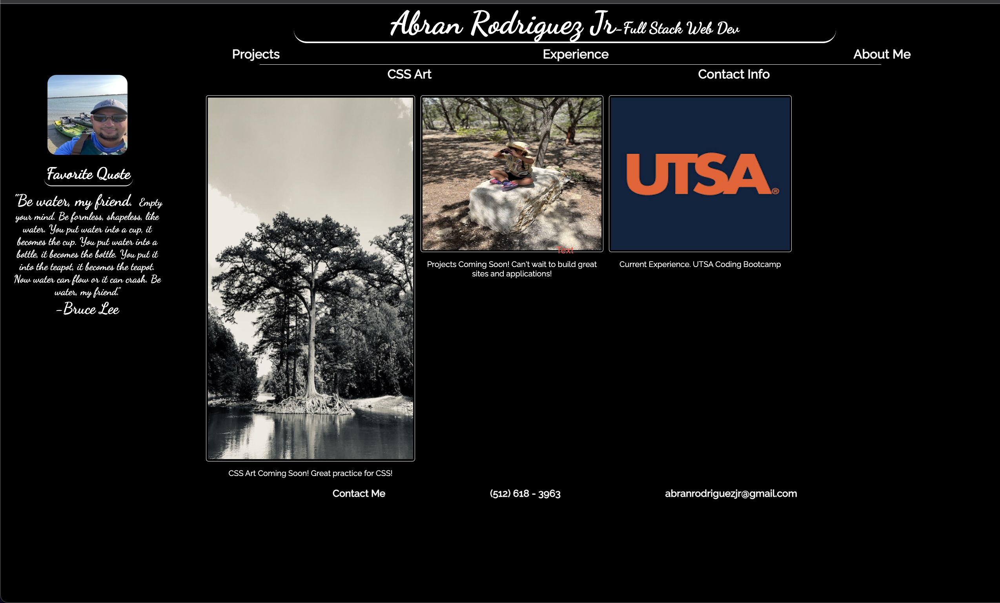

# wk-2-challenge-viva-portfolio

Wk 2 challenge to begin a Web Development portfolio to keep track of projects and be able to bring them to the attention of potential employers.

## Installation

N/A

## Description

Being a beginner in full stack web development, this is my first attempt to create a portfolio. I followed basics learned so far in my coding bootcamp and explored unknown techniques through research and trial and error. There are a couple of elements that use a psuedo:after, :hover, etc. Images are links as well to coming projects and coding bootcamp website. The about me section is fixed to the side and the links will send you to the section described.

## Mock up

The following image shows what the completed exercise should display.

## Link to application

Here is the link to the completed exercise for week 2 Portfolio challenge.

